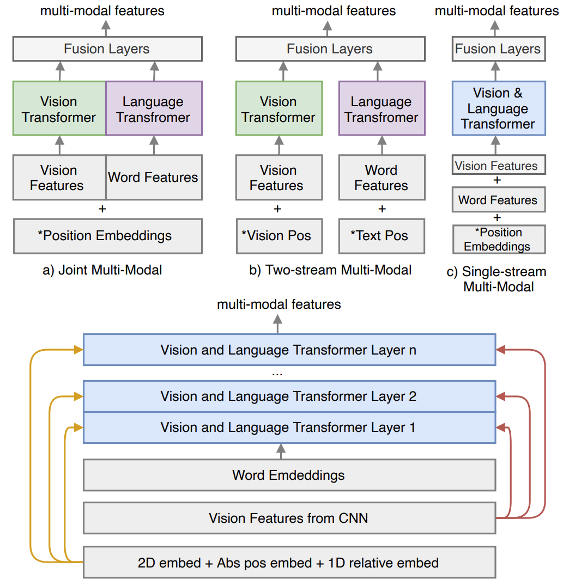

# DocFormer - PyTorch



Implementation of [DocFormer: End-to-End Transformer for Document Understanding](https://arxiv.org/abs/2106.11539), a multi-modal transformer based architecture for the task of Visual Document Understanding (VDU) 📄📄📄.

DocFormer is a multi-modal transformer based architecture for the task of Visual Document Understanding (VDU). In addition, DocFormer is pre-trained in an unsupervised fashion using carefully designed tasks which encourage multi-modal interaction. DocFormer uses text, vision and spatial features and combines them using a novel multi-modal self-attention layer. DocFormer also shares learned spatial embeddings across modalities which makes it easy for the model to correlate text to visual tokens and vice versa. DocFormer is evaluated on 4 different datasets each with strong baselines. DocFormer achieves state-of-the-art results on all of them, sometimes beating models 4x its size (in no. of parameters).

The official implementation was not released by the authors.

## Install

There might be some issues with the import of pytessaract, so in order to debug that, we need to write

```python
pip install pytesseract
sudo apt install tesseract-ocr
```

And then,

```python
!git clone https://github.com/shabie/docformer.git 


```

## Usage

```python
import sys 
sys.path.extend(['docformer/src/docformer/'])
import modeling, dataset
from transformers import BertTokenizerFast


config = {
  "coordinate_size": 96,
  "hidden_dropout_prob": 0.1,
  "hidden_size": 768,
  "image_feature_pool_shape": [7, 7, 256],
  "intermediate_ff_size_factor": 4,
  "max_2d_position_embeddings": 1000,
  "max_position_embeddings": 512,
  "max_relative_positions": 8,
  "num_attention_heads": 12,
  "num_hidden_layers": 12,
  "pad_token_id": 0,
  "shape_size": 96,
  "vocab_size": 30522,
  "layer_norm_eps": 1e-12,
}

fp = "filepath/to/the/image.tif"

tokenizer = BertTokenizerFast.from_pretrained("bert-base-uncased")
encoding = dataset.create_features(fp, tokenizer, add_batch_dim=True)

feature_extractor = modeling.ExtractFeatures(config)
docformer = modeling.DocFormerEncoder(config)
v_bar, t_bar, v_bar_s, t_bar_s = feature_extractor(encoding)
output = docformer(v_bar, t_bar, v_bar_s, t_bar_s)  # shape (1, 512, 768)
```

##  License

MIT

## Maintainers

- [uakarsh](https://github.com/uakarsh)
- [shabie](https://github.com/shabie)

## Contribute


## Citations

```bibtex
@InProceedings{Appalaraju_2021_ICCV,
    author    = {Appalaraju, Srikar and Jasani, Bhavan and Kota, Bhargava Urala and Xie, Yusheng and Manmatha, R.},
    title     = {DocFormer: End-to-End Transformer for Document Understanding},
    booktitle = {Proceedings of the IEEE/CVF International Conference on Computer Vision (ICCV)},
    month     = {October},
    year      = {2021},
    pages     = {993-1003}
}
```
